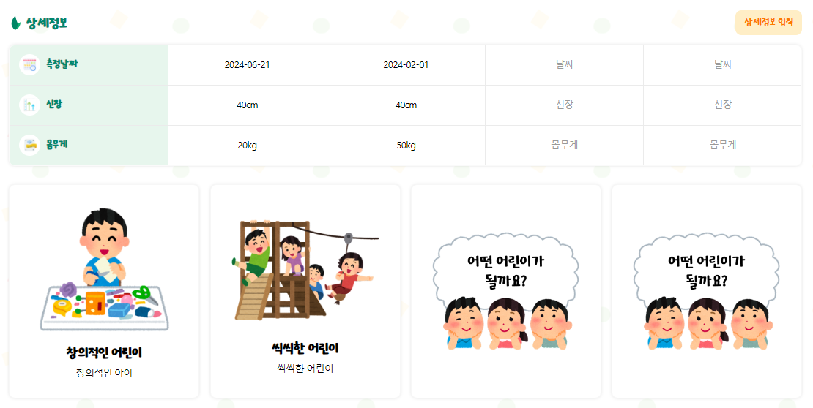

### 버스를 누르게 되면 프로젝트에 참여한 팀원들의 깃허브에 접근할 수 있다  

#### (서버가 열리는 기간동안만)

 

### 떡잎 유치원(http://112.222.157.156:5224)

: 9월까지만 오픈됩니다.

학원 서버를 통해 백엔드 운영중으로 학원 상황에 따라 접속이 불가할 수 있는 점 양해 부탁드립니다.

로그인 최고관리자 원장님 ( ID : 123, PW : 123 ), 선생님 ( ID : tea125, PW : 123 ), 학부모 ( ID : user2, PW : 1234 )
 
 
 

## 💁 서비스 소개

 

### 타겟층

- 유치원생 자녀 또는 가족 구성원을 둔 보호자
- 원생들의 보호자와 필수로 소통을 해야 하는 교사

### 주목적

- 원생들의 보호자들과 소통을 해야 하지만 개인 정보와
  사생활을 지키고 싶은 모든 교사들
- 아이들의 개인 정보 관리와 알림장, 앨범 관리를
  원활하게 하고 싶어하는 교사들과 선생님들 개인 정보 관리도
  원활하게 하고 싶어하는 원장
- 아이들의 일상 사진과 행사 사진을 저장 용량 상관없이
  오래 보고 싶어하는 보호자
- 선생님과 원활한 소통을 원하는 보호자
   
   

## 💚 서비스 내용

 

### 1. 재원 중인 원아의 보호자만 접근 가능!

- 원장님이 원아 정보를 등록하면 10자리 ( 영어&숫자 ) 랜덤 코드가 발급되며
  그 코드로 인증처리를 해야 회원가입을 진행할 수 있다.
- 식별코드는 언제나 랜덤 숫자로 수정이 가능하며 중복 방지를 했다.
- 회원가입이 완료된 보호자는 원아를 더 연결하고 싶다면 마이페이지에
  아이추가 버튼으로 식별코드를 추가로 입력해
  원아를 연결할 수 있도록 하였다.
   

### 2. 원아와 연결된 보호자들

- 보호자의 회원가입이 진행되면 해당 식별코드를 가진 원아와 자동으로
  연결이 진행된다 ( 최대 2명 )
- 원장과 선생님은 언제든 해당 원아와 부모님의 연결을 끊을 수 있다.
- 회원가입이 완료된 보호자는 원아를 더 연결하고 싶다면 마이페이지에
  ( 가정 내 개인 사정 등등의 이유로 추가한 기능 )
- 연결이 끊어진 부모는 끊어진 원아에 대한 정보에는 접근이 불가하다
  만약 아예 해당 홈페이지에 접근을 막고 싶다면
  ( 두 아이가 재원 상태인데 이혼으로 인해 아이를 한 명씩 맡게 됐을 때
  따로 접근을 원할 경우를 생각해 연결끊기가 계정 삭제로 이어지지 않게 하였다.)
   

### 3. 소통은 알림장으로

- 선생님과 보호자들이 소통할 수 있는 용도의 알림장 기능
- 원아 대상으로 알림장이 발송되며 해당 원아와 연결된 부모만 알림장을 볼 수 있고
  댓글로 소통이 가능하다.
- 보호자의 아이가 2명 이상이라면 목록을 눌러 분류하여 볼 수 있다.
- 채팅하는 느낌을 주기 위해 댓글 디자인을 말풍선으로 표현했다.
- 부모님과 선생님 양측 다 알림장 작성이 가능하며 긴급표시체크도 할 수 있다.
   

### 4. 아이들에게 성적보단 칭찬카드를!

- 학원에서 제시했던 큰 카테고리 중 하나인 성적 관리 시스템을 넣으려고 했는데
  너무 어린 아이들이라 성적을 매기기보단 칭찬 카드를 분기별로 주며
  그때의 아이들의 특성을 메모하고 알맞은 칭찬 키워드를 넣어주는 것으로 하였다.
- 분기별로 입력이 가능하며 같은 분기 ( 3-5, 6-8, 9-11, 12-2 )에는 중복으로 입력이 불가하다

### 5. 아이들의 신체 정보 기록하기

- 칭찬카드와 동일한 분기별 기록이 가능하다.
- 키, 몸무게, 그 분기 특성에 대한 메모가 가능하다.
- 선생님이 작성 시 헷갈리는 것을 방지하기 위해 해당 원아의 간단한 정보를 작성/수정 시에
  조회하여 보여주었다.
   

### 6. 활동 앨범으로 우리 아이들의 일상 살펴보기

- 아이들의 단체 활동 사진 위주로 올리는 게시판
- 글과 함께 최대 20장의 사진 업로드가 가능하며 사진이 없다면 업로드가 안된다.
  20장을 넘어도 업로드가 되지 않도록 하였다.
  수정 시도 마찬가지로 추가로 사진을 더 올리게 되어도
  기존 사진과 합친 총 개수가 20장을 넘지 않도록 하였다.
- 댓글 작성도 가능하게 하였다.
   

### 7. 전체공지는 유치원 소식 게시판에서!

- 보호자들에게 개별로 가는 공지 외 유치원은 공식 행사 등등을 공지사항은
  유치원 소식 게시판에 업로드가 가능하게 하였다.
- 상단에 고정이 가능한 고정 공지 기능을 추가했으며 최대 3개가 가능하게 하였다.
- 사진 업로드는 최대 10장이며 사진이 없어도 업로드가 가능한 게시판이다.
- 문의 사항은 선생님들이 관리하기 편하게 알림장을 통해 받을 수 있도록
  댓글 기능은 따로 넣지 않았다.
   

 
 

## 프로젝트 리소스

### 🎥 시연 영상

[2차 시연영상 바로가기](https://youtu.be/SdolCKqjZKw) 👈  
[3차 시연영상 바로가기](https://youtu.be/bYq38cG8pIk) 👈
 
 

### 📂 프로젝트 정보

[팀노션 바로가기](https://alert-stomach-4e6.notion.site/2-3-f77ee2e63bbc41ee8667735ac3a8b81f) 👈  
[디자인 바로가기](https://www.figma.com/design/gIZngWcEB3WWjHjJ1UmXx7/2%2C3%EC%B0%A8-%ED%94%84%EB%A1%9C%EC%A0%9D%ED%8A%B8-%EB%96%A1%EC%9E%8E%EC%9C%A0%EC%B9%98%EC%9B%90?node-id=579-1919&t=KhIIaacedtQX7fz4-0) 👈  
[PPT 바로가기](https://www.canva.com/design/DAF_L45HXSk/qaMc76qKsI1uzQs_9YhGkw/view) 👈

 
 

### 👪 개발 팀 소개

- 김도현(3차 팀장) : 요구사항명세서, 유치원 소식(리스트, 상세, 등록, 수정, 삭제), 알림장 상세, 등록, 수정
- 김소미 : 디자인, 화면상세설계서, 메인, 로그인, 회원가입, 마이페이지, 유치원소개, 육아정보, 알림장 리스트, 만든사람들, 전체 페이지 반응형
- 도선경 : 관리자 (학부모 관리, 원생 관리, 선생님 관리), Notion 정리, 회의록, canva
- 이상재(2차 팀장) : 총괄, 깃헙 관리, 폴더구조 및 코딩 컨벤션 세팅, 활동 앨범, 추억 앨범 (리스트, 상세, 등록, 수정, 삭제)

 
 

### 🛠 기술 스택

  

 

 

 

